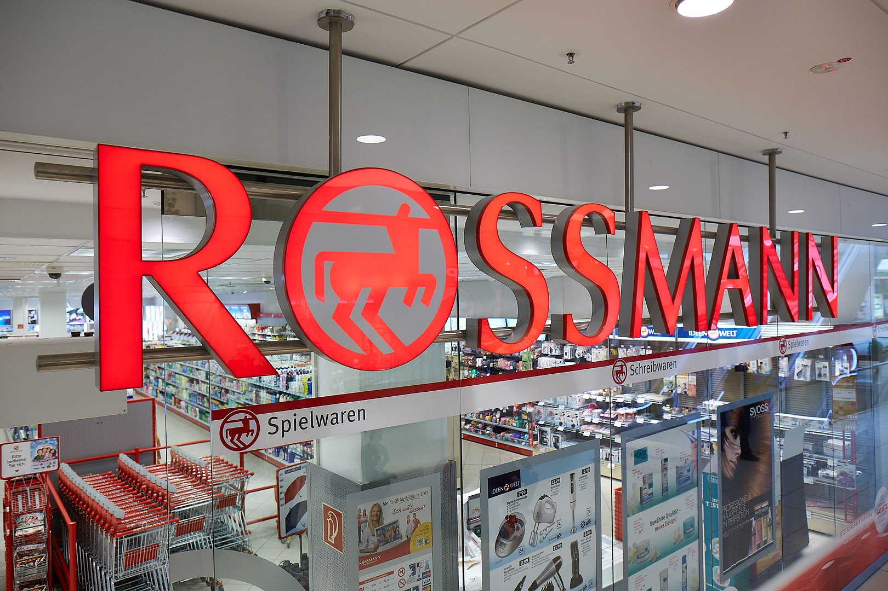
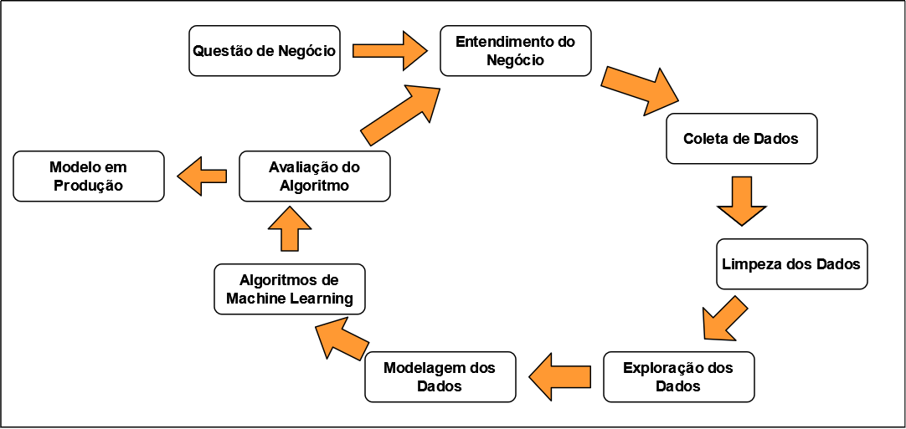
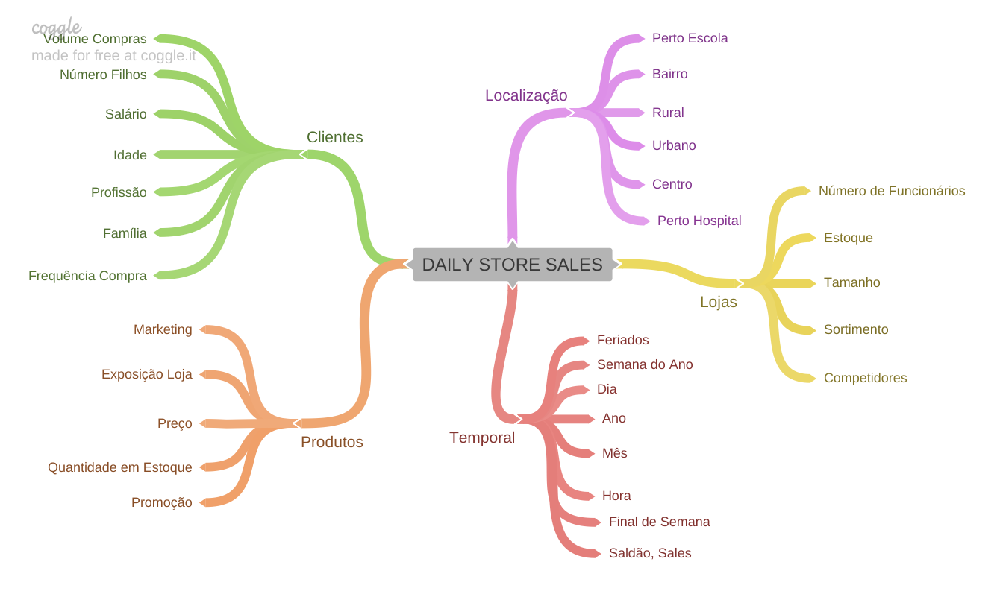
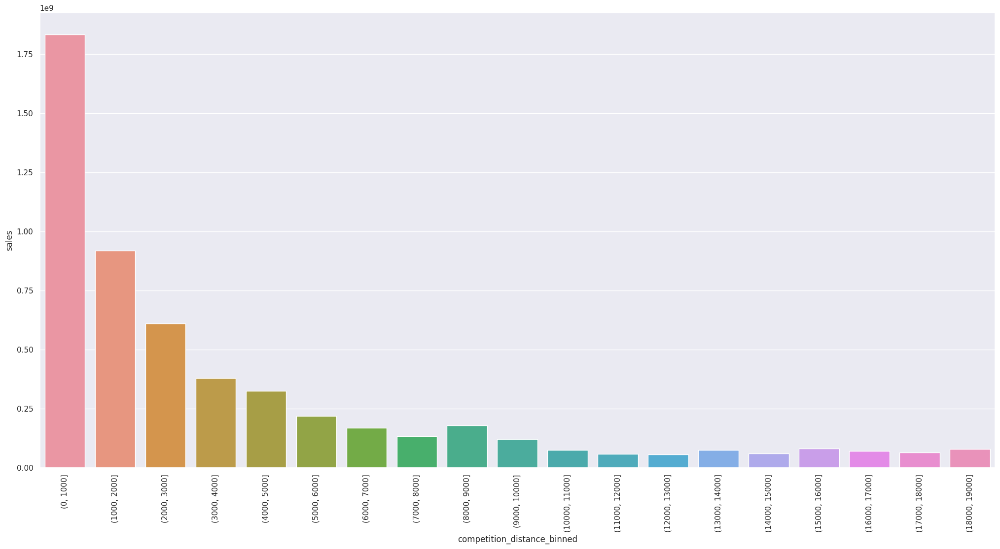
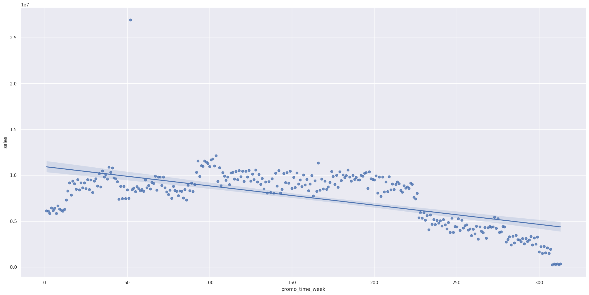
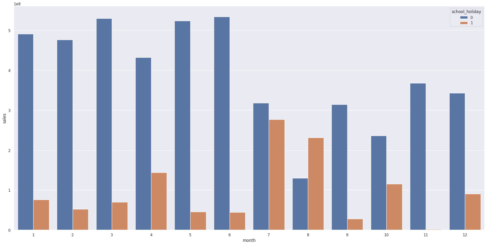
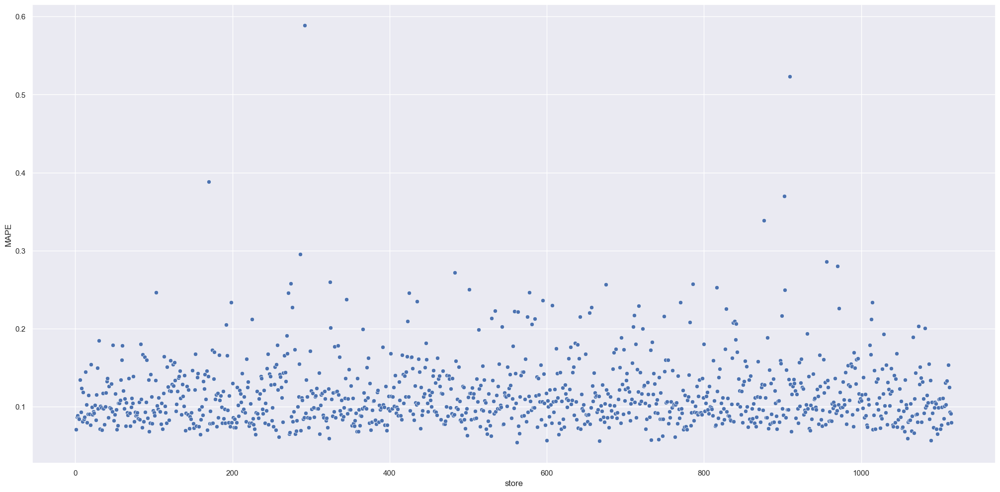

# Previsão de Vendas - Farmácias Rossmann

A Rossmann é uma rede de farmácias com mais de 3000 lojas em 7 países da Europa.
Os dados utilizados nesse projeto foram disponibilizados pela empresa e obtidos através da plataforma de competições [Kaggle](https://www.kaggle.com/competitions/rossmann-store-sales/overview/description) 

# Problema de Negócio

O CFO da rede Rossmann quer fazer reformas nas lojas e para isso precisa ter uma previsão de quanto cada loja vai vender nas proximas 6 semanas para que ele possa saber quanto podera disponibilizar de investimento para cada uma das lojas. 

As vendas da loja são influenciadas por muitos fatores, incluindo promoções, concorrência, feriados escolares e estaduais, sazonalidade e localidade. Com milhares de gerentes individuais prevendo vendas com base em suas circunstâncias únicas, a precisão dos resultados pode variar bastante.

# Premissas do Negócio
- Lojas que não possuíam dados de competidores próximos tiveram o valor da distância atribuido em 200000 metros.
- Foram considerados para a previsão apenas as lojas que posuíam o valor de vendas superior a 0 e somente os dias em que as lojas estavam abertas.
- A variável customers foi removida pois não estaria disponível no momento da previsão.

| Atributo | Definição | 
| -------- | -------- | 
| store                        | Identificador unico de cada loja  | 
| day_of_week                  | Dia da semana  | 
| date                         | Data  |
| sales                        | Número de negócios para um determinado dia 
| customers                    | O número de clientes em um determinado dia |
| open                         | Um indicador para saber se a loja estava aberta: 0 = fechada, 1 = aberta  |
| promo                        | Indica se uma loja está realizando uma promoção naquele dia  |
| state_holiday                | Indica um feriado de estado. a = feriado público, b = feriado de páscoa, c = natal, 0 = não há feriado |
| school_holiday               | Indica se a loja estava fechada ou não no feriado escolar |
| store_type                   | Indica o modelo de loja, que pode ser: a, b, c, d  |
| assortment                   | Indica o nível de variedade de produtos: a = básico, b = extra, c = estendido  |
| competition_distance         | Distância em metros para o competidor mais próximo |
| competition_opne_since_month | Indica o mês aproximado em que o concorrente mais próximo foi aberto  |
| competition_open_since_year  | Indica o ano em que o competidor mais próximo foi aberto  |
| promo2                       | Indica se a loja está estendendo a promoção: 0 = a loja não está participando, 1 = a loja está participando  |
| promo2_since_week            | Indica a semana em que a loja começpu a participar da promoção estendida  |
| promo2_since_year            | Indica o ano em que a loja começou a participar da promoção estendida |
| promo_interval               | Descreve os meses em que a loja iniciou a promo2, ex.: "Feb,May,Aug,Nov" significa que a loja iniciou as promoções estendidas em cada um desses meses |

# Estratégia da Solução

A estratégia para resolver esse problema se baseia na metodologia CRISP-DS
O método CRISP-DS se baseia na entrega por ciclos, priorizando a entrega rápida e acrescentando melhorias a cada ciclo. 

Os passos no primeiro ciclo foram os seguintes:

1. Entendimento do Negócio: entender a motivação do time de negócio e a causa raiz do problema, propor o formato de entrega da solução, que no caso será um bot no Telegram que dado o número da loja, será retornado a previsão de vendas das proximas 6 semanas.

2. Coleta de Dados: Nesta etapa é feita a coleta de dados do banco de dados da empresa. Para este projeto será feita a importação dos dados em um arquivo .csv vindo da plataforma Kaggle.

3. Limpeza dos Dados: Nesta etapa é feita a descrição dos dados, checagem e preenchimento de valores faltantes, transformação adequada de tipo das variáveis

4. Exploração dos Dados: Nesta etapa é criado a lista de hipóteses, filtragem e seleção de variáveis, validar as hipóteses de negócio, verificar como as variáveis impactam o fenômeno e quais as mais importantes para o modelo.

5. Modelagem dos Dados: Nesta etapa são feitas as transformações necessarias antes de treinar o modelo, como encoding, reescaling e transformação de natureza das variáveis. Também é feita a seleção das features mais relevantes para o modelo e é feita a divisão do dataset entre treino e teste.

6. Algoritmos de Machine Learning: Nesta etapa são aplicados os algoritmos de Machine Learning nos dados preparados. Aqui é feito a comparação de performance entre os algoritmos e escolhido o melhor. Com o algoritmo escolhido é feita a escolha dos melhores hiperparametros para que o algritmo fique com uma performance maior e pronto para ser colocado em produção.

7. Avaliação do algoritmo:  Nesta etapa e feita a tradução e interpretação do erro, onde é avaliado se a performance é aceitável para por em produção, caso contrário começa um novo ciclo buscando melhorias.

8. Modelo em produção: Nesta etapa o modelo é colocado em produção podendo ser acessado pelas partes interessadas.  

# Top 3 Insights

## Mapa de Hipóteses
O Mindmap foi criado para ajudar a escrever as hipóteses e auxiliar na exploração dos dados.

# Insights
Foram selecionadas 12 hipóteses para validação. As 3 principais geraram os insights abaixo:

| Insight 1 - Lojas com competidores mais próximos vendem mais |
| -------- |
|  |

| Insight 2 - Lojas com promoções ativas por mais tempo vendem menos |
| -------- |
|  |

| Insight 3 - Lojas vendem menos durante os feriados escolares |
| -------- |
|  |

# Modelos de Machine Learning
Os 5 algoritmos selecionados para esse projeto foram:
1. Average Model.
2. Linear Regression.
3. Linear Regression Regularized.
4. Random Forest Regressor.
5. XGBoost Regressor.

Os resultados de treinamento e teste dos algoritmos foram os seguintes:
| Model Name | MAE | MAPE | RMSE |
| -------- | -------- | -------- | -------- |
| Random Forest Regressor  | 679.598 | 0.0999  | 1011.119  |
| XGBoost Regressor  | 868.958 | 0.1303  | 1238.550  |
| Average Model  | 1354.800  | 0.2064  | 1835.135  |
| Linear Regression  | 1867.089  | 0.2926  | 2671.049  |
| Linear Regression - Lasso  | 1891.704  | 0.2891  | 2744.451  |

Onde MAE=Mean Absolute Error; MAPE=Mean Absolute Percentage Error; RMSE=Root Mean Squared Error.

Aplicando o método de Cross Validation:
| Model Name | MAE CV | MAPE CV | RMSE CV |
| -------- | -------- | -------- | -------- |
| Random Forest Regressor  | 836.61+/- 217.1 | 0.12+/- 0.02  | 1254.3+/- 316.17  |
| XGBoost Regressor  | 1064.94+/- 178.65 | 0.15+/- 0.02  | 1519.92+/- 242.12  |
| Linear Regression  | 2081.73+/- 295.63  | 0.3+/- 0.02  | 2952.52+/- 468.37  |
| Linear Regression - Lasso  | 2116.38+/- 341.5  | 0.29+/- 0.01  | 3057.75+/- 504.26  |

Apesar de o algoritmo Random Forest Regressor ter apresentado o melhor resultado, para esse projeto foi escolhido o XGBoost Regressor por ser mais rápido e leve e ter um resultado bem próximo ao melhor.

Em seguido foi aplicado a técnica de Random Search para encontrar os melhores hiperparâmetros. O resultado final com os parametros otimizados foi:
| Model Name | MAE | MAPE | RMSE |
| -------- | -------- | -------- | -------- |
| XGBoost Regressor  | 770.209 | 0.1156  | 1108.062  |

# Resultado de Negócio
Com o algoritmo escolhido pronto para fazer previsões, as lojas com melhor resultado de previsão para as próximas 6 semanas são as seguintes:

| Loja | Previsões | Pior Cenário | Melhor Cenário | MAE | MAPE | 
| -------- | -------- | -------- | -------- | -------- | -------- |
| 562  |	$ 745,088.12  |	$ 744,181.19 |	$745,995.05 |	$ 906.92 |	0.0541 |
| 667  |	$ 317,574.59  |	$ 317,076.76 |	$318,072.42 |	$ 497.83 |  0.0563 |
| 1089 |  $ 369,152.90  |	$ 368,546.44 |	$369,759.36 |	$ 606.45 |	0.0567 |
| 600  |	$ 277,905.75  |	$ 277,499.83 |	$278,311.66 |	$ 405.91 |	0.0571 |
| 733  |	$ 654,944.56  |	$ 654,105.54 |  $655,783.57 |	$ 839.01 |	0.0572 |

## Performance Final
A soma das previsões, do melhor e pior cenários de todas as lojas é a seguinte:
| Cenário | Valores | 
| -------- | -------- | 
| Predições  | $ 285,817,920.00 |
| Pior Cenário  | $ 284,955,855.73 | 
| Melhor Cenário  | $ 285,817,784.44 | 

O gráfico abaixo mostra como o erro das previsões está distribuido em uma faixa aceitável, com uma quantidade pequena de previsões com erros maiores.

# Conclusão
O objetivo do projeto, que era ter a previsão de vendas das lojas foi cumprido. O CFO agora pode consultar os resultados pelo bot no Telegram aqui
Além das previsões, o CFO pode ter novas ideias para melhoria no negócio com os insights apresentados nesse projeto.

# Próximos passos
- Investigar o motivo dos valores faltantes.
- Criar novas hipóteses e extrair mais insights
- Criar novas features que ajudem na previsão do modelo
- Testar algoritmos de Machine Learning diferentes
- Disponibilizar a solução final com mais detalhes.
